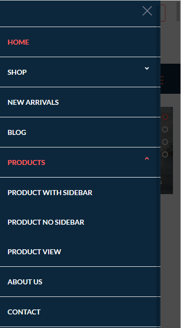

# Site Navigation




### Site Navigation HTML Code {#site-navigation-html-code}

The below code can be found in all HTML pages that are included with the theme. code will be placed from 651th to 771th line of each page.

```markup
<ul class="nav-menu">
    <li class=" active "><a href="index.html" title="HOME" id="home">HOME</a></li>
    <li class=""><a href="#" title="SHOP" id="shop">SHOP</a>
        <div class="megamenu-panel nav-submenu">
            <div class="megamenu-lists">
                <div class="mega-col col-xs-12 col-sm-12 col-md-3 col-lg-3">
                    <div class="mega-pro-image"></div>
                    <h5>Latest Arrivals</h5>
                    <ul class="megamenu-list">
                        <li class=""><a href="#" title="goprofessional adapter"
                                        id="goprofessionaladapterpartthree">goprofessional
                            adapter</a></li>
                        <li class=""><a href="#" title="Drone fly action camera"
                                        id="Droneflyactioncamerapartthree">Drone fly
                            action camera</a></li>
                        <li class=""><a href="#" title="Single hoodies action"
                                        id="shapartthree">Single hoodies action</a>
                        </li>
                        <li class=""><a href="#" title="Drone width action"
                                        id="dwa2partthree">Drone width action</a>
                        </li>
                        <li class=""><a href="#" title="Drone width Camera"
                                        id="dwcpartthree">Drone width Camera</a>
                        </li>
                        <li class=""><a href="#" title="Camera albums"
                                        id="caspartthree">Camera albums</a></li>
                        <li class=""><a href="#" title="Investments shirts albums"
                                        id="isapartthree">Investments shirts
                            albums</a></li>
                        <li class=""><a href="#" title="Drone width action"
                                        id="dwa3partthree">Drone width action</a>
                        </li>
                    </ul>
                </div>
                <div class="mega-col col-xs-12 col-sm-12 col-md-3 col-lg-3">
                    <div class="mega-pro-image"></div>
                    <h5>Latest Arrivals</h5>
                    <ul class="megamenu-list">
                        <li class=""><a href="#" title="goprofessional adapter"
                                        id="goprofessionaladapterpartone">goprofessional
                            adapter</a></li>
                        <li class=""><a href="#" title="Drone fly action camera"
                                        id="Droneflyactioncamerapartone">Drone fly
                            action camera</a></li>
                        <li class=""><a href="#" title="Single hoodies action"
                                        id="shapartone">Single hoodies action</a>
                        </li>
                        <li class=""><a href="#" title="Drone width action"
                                        id="dwapartone">Drone width action</a></li>
                        <li class=""><a href="#" title="Drone width Camera"
                                        id="dwpartone">Drone width Camera</a></li>
                        <li class=""><a href="#" title="Camera albums"
                                        id="capartone">Camera albums</a></li>
                        <li class=""><a href="#" title="Investments shirts albums"
                                        id="ispartone">Investments shirts albums</a>
                        </li>
                        <li class=""><a href="#" title="Drone width action"
                                        id="dwapartoone">Drone width action</a></li>
                    </ul>
                </div>
                <div class="mega-col col-xs-12 col-sm-12 col-md-3 col-lg-3">
                    <div class="mega-pro-image"></div>
                    <h5>Latest Arrivals</h5>
                    <ul class="megamenu-list">
                        <li class=""><a href="#" title="goprofessional adapter"
                                        id="goprofessionaladapterpartwo">goprofessional
                            adapter</a></li>
                        <li class=""><a href="#" title="Drone fly action camera"
                                        id="Droneflyactioncamerapartwo">Drone fly
                            action camera</a></li>
                        <li class=""><a href="#" title="Single hoodies action"
                                        id="shapartwo">Single hoodies action</a>
                        </li>
                        <li class=""><a href="#" title="Drone width action"
                                        id="dwapartwo">Drone width action</a></li>
                        <li class=""><a href="#" title="Drone width Camera"
                                        id="dwcpartwo">Drone width Camera</a></li>
                        <li class=""><a href="#" title="Camera albums"
                                        id="caspartwo">Camera albums</a></li>
                        <li class=""><a href="#" title="Investments shirts albums"
                                        id="isapartwo">Investments shirts albums</a>
                        </li>
                        <li class=""><a href="#" title="Drone width action"
                                        id="dwa3partwo">Drone width action</a></li>
                    </ul>
                </div>
                <div class="mega-col col-xs-12 col-sm-12 col-md-3 col-lg-3">
                    <div class="mega-pro-image"><a href="#"></a></div>
                </div>
            </div>
        </div>
    </li>
    <li class=""><a href="new-arrivals.html" title="NEW ARRIVALS" id="new-arrivals">NEW
        ARRIVALS</a></li>
    <li class=""><a href="blog.html" title="BLOG" id="blog">BLOG</a></li>
    <li class=" dropdown "><a href="#" title="PRODUCTS" id="products">PRODUCTS <span
            class="caret"></span></a>
        <ul class="nav-dropdown nav-submenu">
            <li class=""><a href="products-with-sidebar.html"
                            title="PRODUCT WITH SIDEBAR" id="products-with-sidebar">PRODUCT
                WITH SIDEBAR</a></li>
            <li class=""><a href="products-no-sidebar.html"
                            title="PRODUCT NO SIDEBAR" id="products-no-sidebar">PRODUCT
                NO SIDEBAR</a></li>
            <li class=""><a href="product-view.html" title="PRODUCT VIEW"
                            id="product-view">PRODUCT VIEW</a></li>
        </ul>
    </li>
    <li class=""><a href="about.html" title="ABOUT US" id="about">ABOUT US</a></li>
    <li class=""><a href="contact.html" title="CONTACT" id="contact">CONTACT</a>
    </li>
    <li class=""><a href="#" title="BUY NOW" id="buy-now">BUY NOW</a></li>
</ul>
```

